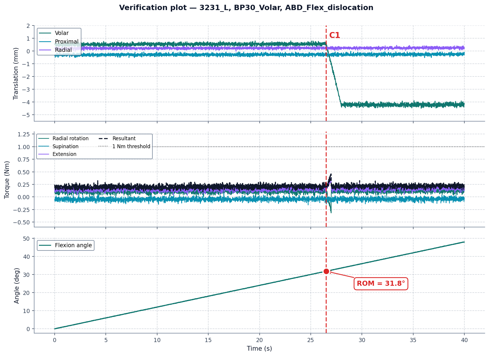
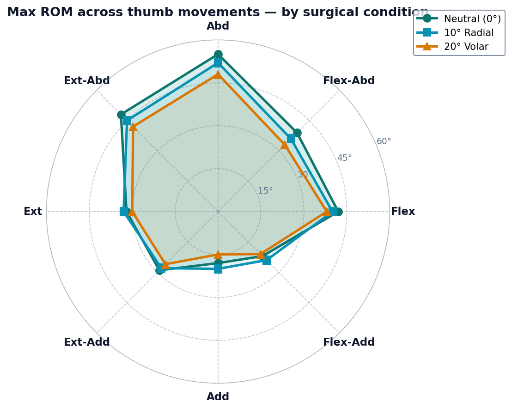

# Biomechanical Data Pipeline: Thumb CMC Arthroplasty (Ottawa Hospital)

Automated Python pipeline that transforms raw robotic biomechanical test data into clinical range-of-motion (ROM) tables and verification plots, built for an Honours Project (CSI 4900, University of Ottawa) in collaboration with **The Ottawa Hospital**.

> Note: all data originates from cadaveric specimen testing (no patient/clinical records involved).

**Skills demonstrated:** Python, signal processing, binary/TDMS data parsing, data engineering pipeline design, iterative threshold calibration & validation, technical documentation

## Context

The Ottawa Hospital is investigating the optimal trapezial cup orientation for thumb CMC (carpometacarpal) joint replacement, a common site of osteoarthritis that affects up to 39% of women over 80. Correct cup positioning is critical to prevent implant dislocation, but no systematic biomechanical evidence existed to guide it.

The hospital's team ran a robotic testing protocol across 8 cadaveric specimens, 15 surgical cup orientations, and 8 passive thumb movements, generating up to **960 individual trials**. Each trial produced a raw binary TDMS file with synchronized kinematic and load signals, and there was no existing tool to turn these files into usable clinical data.

**My role:** design and build the entire data engineering pipeline, end to end, from raw signal parsing to publication-ready summary tables, with no pre-existing tooling to build on. The clinical team had no one able to translate the robot's raw signal data into usable insights. This pipeline is what turned hundreds of binary files into concrete, clinically actionable conclusions.

## What the pipeline does

1. **Discovery**: recursively scans the specimen directory tree, matches files by movement code and naming convention, and extracts specimen ID and surgical condition from folder/file names.
2. **Extraction**: reads 9 synchronized signal channels (time, translations, torques, joint angles) per trial from binary TDMS files via `nptdms`.
3. **Stopping-point detection**: applies a hierarchical 4-criterion rule (torque-rate drop, then translation > 4mm, then resultant torque ≥ 1 Nm, then translation drop) to find the clinically meaningful ROM limit for each trial, evaluated in strict priority order.
4. **Angle extraction**: pulls the relevant joint angle at the detected stopping point (max of two channels for combined movements, e.g. Flexion-Abduction).
5. **Output**: writes structured CSV tables (per-specimen, all-specimens, cross-specimen mean ± SD) plus a 3-panel verification plot (translation / torque / angle vs. time) per trial, with the detected stopping point marked.

All scientific thresholds (torque-rate limit, translation limits, sample offsets) live in a single `config.json`, so the hospital team or future researchers can retune the pipeline without touching the code.

## Key engineering decision: threshold calibration

The protocol's initial torque-rate threshold (−0.005 Nm/s) was far too sensitive. It fired on virtually every trial due to normal signal noise during the robot's settling phase, collapsing all results onto a single criterion. I resolved this through iterative visual validation: running the verification script against trials already scored manually by the hospital team, and stepping the threshold through −0.1, −0.2, −0.5, −1.0, −5.0, and finally **−10.0 Nm/s**, checking at each step that the detected stopping point visually matched the real instability event. That's a 2000× adjustment from the initial spec, empirically validated and locked into config.

## Results

- Pipeline successfully deployed across all 8 specimens (2 fully validated end-to-end, 6 integrated and processed).
- 960 possible trial combinations processed automatically, with graceful handling of missing/misnamed files (flagged, not crashed).
- Output tables match the clinical team's requested format exactly, ready for direct use in their study.
- Manual scoring of ROM limits, meaning visually reviewing each angle/position across every trial, was described by the clinical team as extremely time-consuming even at the scale of a single specimen, making it impractical to extend to larger cohorts. The pipeline removes that bottleneck entirely: it scales to any number of specimens with no additional manual effort, turning a process that didn't scale past a handful of cadavers into one that could support a full clinical-scale study.

## Visuals

**Verification plot**, produced automatically for any single trial, with the detected stopping point marked:



**Cross-condition ROM summary**, comparing max range of motion across all thumb movements for different surgical orientations:



## Stack

Python, `nptdms`, `numpy`, `pandas`, `matplotlib`

## Repository structure

```
build_full_table_v3.py     # main pipeline, processes all specimens
verify_criteria_v3.py      # single-trial visual verification tool
generate_all_tables.py     # formatted per-specimen pivot tables
config.json                # thresholds, specimen list, channel mapping, paths
```

## Running it

```bash
python build_full_table_v3.py
python verify_criteria_v3.py   # prompts interactively for the .tdms file path and movement code
```

Full setup and usage instructions, including configuration reference and troubleshooting, are in [`docs/USER_GUIDE.md`](docs/USER_GUIDE.md).

## Deliverables

- `full_ROM_all_specimens.csv`: global flat results table
- `ROM_<specimen>.csv`: one file per specimen
- `ROM_Table_Average.csv`: cross-specimen mean ± SD per condition/movement
- Verification plots (PNG): one 3-panel plot per trial

---

*Honours Project, University of Ottawa. Salma Sabbar & Dallaire Cubahiro. Supervised by Dr. Nan Chen, in collaboration with Ariane Parisien and The Ottawa Hospital.*
